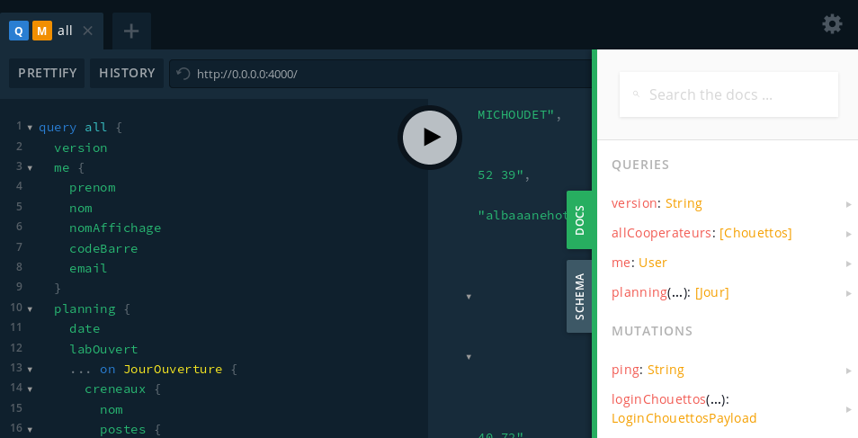

# L'API de La Chouette Coop

[](http://commitizen.github.io/cz-cli/)

**PROTOTYPE** Cette application est encore au stade d'expérimentation, avant de
pouvoir être proposée sérieusement à des groupes.

Cette application vise à exposer en un seul endroit l'ensemble des données de
La Chouette Coop. Elle permet un accès homogène à des données issues de diverses
applications / fichiers, ouvrant la possibilité à des croisements de données et
à la construction d'applications spécifiques rapidement.

De manière plus technique, c'est une API GraphQL permettant d'accéder aux données
suivantes :

- Authentification via le LDAP
- Annuaire des coopérateurs et coopératrices de la SAS
- Planning du Lab

Les données accessibles dépendent des permissions de la personne connectée.

## Documentation

L'API déployée est une [API GraphQL](https://graphql.org/). Le but principal de
celle-ci est d'être utilisée par des applications tierces.

En accédant à celle-ci depuis un navigateur web, une instance du logiciel
[GraphQL Playground](https://github.com/prisma/graphql-playground) permet
d'exécuter des requêtes pour « explorer l'API ».

Un onglets « Docs » permet de naviguer dans les requêtes et champs disponibles,
ainsi que leurs documentations respectives :



**Attention : la plupart des informations ne sont pas accessibles au public !**
Il vous faudra donc effectuer vos requêtes en tant qu'un utilisateur ou qu'une
utilisatrice ayant les droits suffisants (toute personne ayant accès à l'espace
membres peut se connecter).

Pour en savoir plus sur cela, voir la page [Authentification](./authentification.md).

## Présentation

Pas encore `¯\_(ツ)_/¯`

## Installation

- `npm install`
- créer un fichier `.env` avec les accès aux services tiers (exemple de fichier
  disponible dans `.env.dist`)

## Lancement

- En mode développeur : `npm run dev`
- En production : `npm run start`

## Tests

Les tests automatisés se lancent avec la commande : `npm run test`

## Contribution

Nous suivons la convention https://www.conventionalcommits.org/ pour les
messages de commits, afin de permettre une publication simple des nouvelles
versions et des changelogs. Nous pensons que cela facilite le suivi du projet et
sa maintenance/reprise sur le long terme.

**Cela n’est pas très compliqué !** Au lieu de faire `git commit`, exécutez
`npm run commit` et laissez-vous guider !

## Release

- `GITHUB_TOKEN="xxxxxx" npm run release`

Vous pouvez ajouter le suffixe `-- -n` à la commande pour une release
entièrement automatisée, si vous osez !

## Déploiement

Une image Docker (`real34/lachouettecoop-api`) est construite à chaque nouveau
changement ou nouvelle version (via les Actions Github décrites dans le dossier
`.github/workflows` du dépôt).

La branche `master` est disponible via le tag `latest`, et les tags (versions)
via leurs tags respectifs.

Il est donc possible de lancer l'application en mode production grâce à Docker.
Le port `4000` est exposé, et il faut rendre disponible les variables d'environnement
contenant les secrets / configurations dans le conteneur (voir [la section d'installation](#installation)).

### Commande Docker

Par exemple, la commande Docker pour lancer l'application serait :

`docker run --rm -P --env-file=/chemin/vers/.env real34/lachouettecoop-api:latest`

Regardez ensuite le port de votre machine sur lequel a été mappé le port `4000` du
conteneur grâce à la commande `docker ps` et accédez à http://0.0.0.0:32768/
(en remplaçant par le numéro de port correct).

### Fichier Docker Compose

Pour une utilisation en production, voici un exemple de fichier `docker-compose.yml`
avec une configuration Traæfik.

```yml
version: "2.1"

services:
  web:
    image: real34/lachouettecoop-api:latest
    restart: unless-stopped
    env_file: .env
    networks:
      default:
      inverseproxy_shared:
    labels:
      traefik.docker.network: "inverseproxy_shared"
      traefik.enable: "true"
      traefik.frontend.passHostHeader: "true"
      traefik.port: "4000"
      traefik.frontend.rule: "Host:api.acme.org"

networks:
  default:
    internal: true
    driver_opts:
      encrypted: 1
  inverseproxy_shared:
    external: true
```
