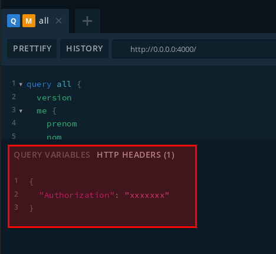

# Authentification

Un mécanisme de Permissions permet de restreindre l'accès aux données.
On peut considérer la philosophie de droits appliquées comme suit :

- très peu de données sont accessibles au public
- les coopérateurs et coopératrices ont accès à des données générales, et des
  actions leur permettant d'évoluer au sein de la Coopérative
- les membres actifs au sein de groupes, ou ayant un rôle particulier (par
  exemple effectuant une <abbr title="Participation Indispensable Au Fonctionnement">PIAF</abbr> spécifique) ont accès aux informations leur
  permettant d'effectuer leurs tâches

Il est donc important d'accéder à l'API de manière spécifique.

## Mécanisme d'authentification

L'authentification se fait en générant un jeton JWT grâce aux identifiants habituels
que vous utilisez au sein de La Chouette Coop : email et mot de passe.

Ce jeton est ensuite transmis lors de chaque appel. Voir les sections suivantes
pour plus de détails.

## Générer un jeton JWT

La génération d'un jeton JWT se fait via la mutation `loginChouettos`.
Le jeton se récupère dans le champ `token` de la réponse.

### Requête

```graphql
mutation login {
  loginChouettos(
    input: { email: "jean.tibou@exemple.fr", password: "Titi31!" }
  ) {
    token
  }
}
```

### Réponse

```json
{
  "data": {
    "loginChouettos": {
      "token": "xxxxxxxxxx"
    }
  }
}
```

Veillez à copier la valeur retournée, c'est le jeton JWT qui sera utile pour
authentifier chaque appel par la suite.

## Accès aux données de manière authentifiée

Afin d'accéder aux données de manière authentifié, il faut communiquer le jeton
JWT récupéré à l'étape précédente dans l'en-tête HTTP `Authorization`.

Par exemple, via l'onglet « HTTP Headers » de GraphQL Playground :

```json
{
  "Authorization": "xxxxxxxxxx"
}
```



Avec ce jeton (tant qu'il est valide), vous devriez désormais être en mesure
d'accéder à de plus amples informations.

Essayez par exemple la requête ci-dessous !

```graphql
query all {
  version
  me {
    prenom
    nom
    nomAffichage
    codeBarre
    email
  }
  planning {
    date
    labOuvert
    ... on JourOuverture {
      creneaux {
        nom
        postes {
          nom
          horaires
          piaffeur {
            nom
            prenom
            telephone
            email
          }
          notes
        }
      }
    }
  }
  allCooperateurs {
    prenom
    nom
    nomAffichage
  }
}
```
